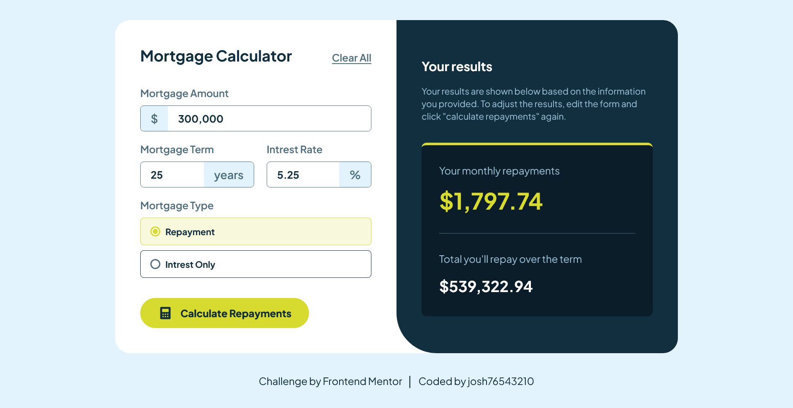

# Frontend Mentor - Mortgage repayment calculator solution

This is a solution to the [Mortgage repayment calculator challenge on Frontend Mentor](https://www.frontendmentor.io/challenges/mortgage-repayment-calculator-Galx1LXK73). Frontend Mentor challenges help you improve your coding skills by building realistic projects.

## Table of contents

- [Overview](#overview)
  - [The challenge](#the-challenge)
  - [Screenshot](#screenshot)
  - [Links](#links)
- [My process](#my-process)
  - [Built with](#built-with)
  - [What I learned](#what-i-learned)
- [Author](#author)

## Overview

### The challenge

Users should be able to:

- Input mortgage information and see monthly repayment and total repayment amounts after submitting the form
- See form validation messages if any field is incomplete
- Complete the form only using their keyboard
- View the optimal layout for the interface depending on their device's screen size
- See hover and focus states for all interactive elements on the page

### Screenshot



### Links

- Solution URL: [https://www.frontendmentor.io/solutions/mortgage-repayment-calculator-yT4-ZujTVs](https://www.frontendmentor.io/solutions/mortgage-repayment-calculator-yT4-ZujTVs)
- Live Site URL: [https://josh76543210-fm-mortgage-calculator.netlify.app/](https://josh76543210-fm-mortgage-calculator.netlify.app/)

## My process

### Built with

- [React](https://reactjs.org/) - JS library
- [Next.js](https://nextjs.org/) - React framework
- [TailwindCSS](https://tailwindcss.com/) - CSS framework

### What I learned

This is the first time I am using Next.js for a Frontend Mentor project. I decided to try using the useContext hook with out the useReducer hook for managing the state of the application and instead just use the useState hook. I realized how the use of the useReducer hook provides a way to keep all of the logic involved with changing the state inside a single function instead of writting it inside each individual component and passing it the setState function from the context. Furthermore, using TailwindCSS to style and make the form interactive and display errors was a bit of a challenge but I managed it without any additional Javascript code.

```jsx
function FormProvider({ children }) {
  const [formState, setFormState] = useState(initialState);

  return (
    <FormContext.Provider value={{ formState, setFormState }}>
      {children}
    </FormContext.Provider>
  );
}
```

```jsx
<div
  className={`flex border rounded-md  overflow-hidden ${
    showError
      ? "mb-2 border-red [&>span]:bg-red [&>span]:text-white"
      : "mb-4 border-slate700 hover:border-slate900 focus-within:border-lime hover:focus-within:border-lime [&>span]:focus-within:bg-lime [&>span]:focus-within:text-slate900"
  } `}
></div>
```

## Author

- GitHub - [@josh76543210](https://github.com/josh76543210)
- Frontend Mentor - [@josh76543210](https://www.frontendmentor.io/profile/josh76543210)
- Twitter - [@josh76543210](https://www.twitter.com/josh76543210)
